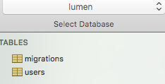
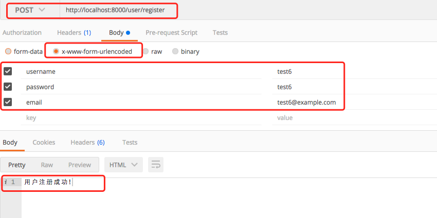
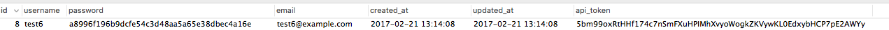
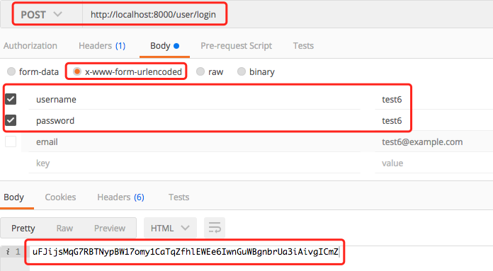
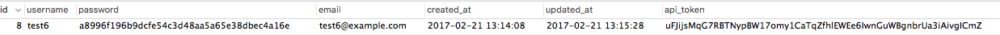
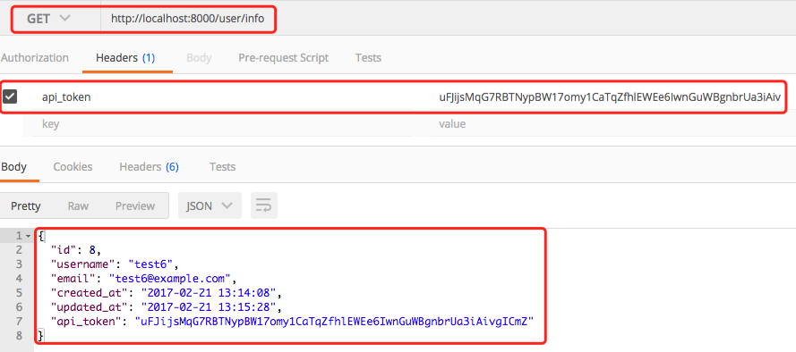

### 前言
Lumen是一个基于Laravel的微框架，号称是以速度为生。截用Lumen官网的一段，号称是比silex和slim还要快。

本文将用Lumen来实现一个完整的用户注册、登录及获取用户信息的API。

Lumen官方网站：https://lumen.laravel.com/
Lumen中文网站：http://lumen.laravel-china.org/

<!-- more -->

### 安装
```sh
composer create-project --prefer-dist laravel/lumen lumen
```

### 数据库配置
跟全栈框架 Laravel 框架不一样的是，所有的 Lumen 框架的配置信息都存储在 .env 文件中。一旦 Lumen 成功安装，你需要 配置本地环境,如果没有在目录下新建.env文件
```sh
APP_ENV=local
APP_DEBUG=true
APP_KEY=SomeRandomString!!!
DB_CONNECTION=mysql
DB_HOST=localhost
DB_PORT=3306
DB_DATABASE=lumen
DB_USERNAME=root
DB_PASSWORD=charlie
CACHE_DRIVER=memcached
QUEUE_DRIVER=sync
APP_TIMEZONE=PRC
DB_TIMEZONE=+08:00
```

### 三 配置迁移数据库
```sh
php artisan make:migration create_users_table --create=users
```
执行这条命令后，会在项目目录lumen/database/migrations/ 目录下生成一个php文件，这个文件主要包括两个函数，在up()函数中根据你的需求定义数据库字段。
```php
<?php

use Illuminate\Support\Facades\Schema;
use Illuminate\Database\Schema\Blueprint;
use Illuminate\Database\Migrations\Migration;

class CreateUsersTable extends Migration
{
    /**
     * Run the migrations.
     *
     * @return void
     */
    public function up()
    {
        Schema::create('users', function (Blueprint $table) {
            $table->increments('id');
            $table->string('username');
            $table->string('password');
            $table->string('email');
            $table->string('api_token', 60)->unique();
            $table->timestamps();
        });
    }

    /**
     * Reverse the migrations.
     *
     * @return void
     */
    public function down()
    {
        Schema::dropIfExists('users');
    }
}
```

执行命令，创建数据库
```sh
php artisan migrate
```
数据库会生成一张users表


###  创建用户数据模型
如果你的项目文件夹lumen\app\文件夹下没有User.php文件，那么新建一个User.php文件，文件内容如下：
``` php
<?php
namespace App;

use Illuminate\Auth\Authenticatable;
use Laravel\Lumen\Auth\Authorizable;
use Illuminate\Database\Eloquent\Model;
use Illuminate\Contracts\Auth\Authenticatable as AuthenticatableContract;
use Illuminate\Contracts\Auth\Access\Authorizable as AuthorizableContract;

class User extends Model implements AuthenticatableContract, AuthorizableContract
{
    use Authenticatable, Authorizable;

    /**
     * The attributes that are mass assignable.
     *
     * @var array
     */
    protected $fillable = [
        'username', 'email', 'password', 'api_token'
    ];

    /**
     * The attributes excluded from the model's JSON form.
     *
     * @var array
     */
    protected $hidden = [
        'password',
    ];
}
```
###  路由定义
定义三个路由，实现用户登录，注册及获取用户信息

路由类型 | 路由路径 | 路由控制器
------------ | ------------- | ------------
POST | user/register  | UserController@register
POST | user/login | UserController@login
GET  | user/info   |UserController@info

根据上述表的内容，在routes/web.php中定义路由
```php
<?php
$app->get('/', function () use ($app) {
    return $app->version();
});

//登录注册
$app->post('user/login', 'UserController@login');
$app->post('user/register', 'UserController@register');
$app->get('user/info', [
    'middleware'    =>  'authToken',
    'uses'  =>  'UserController@info'
]);
```

###  Controller逻辑
在Lumen\app\Http\Controllers\文件夹下新建用户控制器UserController.php，实现用户注册、登录和用户信息获取功能
```php
<?php
namespace App\Http\Controllers;

use App\User;
use App\Http\Controllers\Controller;
use Illuminate\Http\Request;
use Illuminate\Support\Facades\Auth;

class UserController extends Controller
{
    private $salt;

    public function __construct()
    {
        $this->salt = "userloginregister";
    }

    //登录
    public function login(Request $request)
    {
        if($request->has('username') && $request->has('password')){
            $user = User::where('username', '=', $request->input('username'))->where('password', '=', sha1($this->salt.$request->input('password')))->first();
            if($user){
                $token = str_random(60);
                $user->api_token = $token;
                $user->save();
                return $user->api_token;
            }else{
                return '用户名或密码不正确,登录失败';
            }
        }else{
            return '登录信息不完整,请输入用户名和密码';
        }
    }

    //注册
    public function register(Request $request)
    {
        if($request->has('username') && $request->has('password') && $request->has('email')){
            $user = new User;
            $user->username = $request->input('username');
            $user->password = sha1($this->salt.$request->input('password'));
            $user->email = $request->input('email');
            $user->api_token = str_random(60);
            if($user->save()){
                return '用户注册成功!';
            }else{
                return '用户注册失败!';
            }
        }else{
            return '请输入完整用户信息!';
        }
    }

    //信息
    public function info()
    {
        return Auth::user();
    }
```

###  认证服务
必须要通过token验证才能获取用户信息。在Lumen\app\Http\Providers\AuthServiceProvider.php中定义验证服务。我们使用header包含token的形式来验证。修改Lumen\app\Http\Providers\AuthServiceProvider.php文件代码。
```php
<?php
namespace App\Providers;

use App\User;
use Illuminate\Support\Facades\Gate;
use Illuminate\Support\ServiceProvider;

class AuthServiceProvider extends ServiceProvider
{
    /**
     * Register any application services.
     *
     * @return void
     */
    public function register()
    {
        //
    }

    /**
     * Boot the authentication services for the application.
     *
     * @return void
     */
    public function boot()
    {
        // Here you may define how you wish users to be authenticated for your Lumen
        // application. The callback which receives the incoming request instance
        // should return either a User instance or null. You're free to obtain
        // the User instance via an API token or any other method necessary.

        $this->app['auth']->viaRequest('api', function ($request) {
            if ($request->header('api_token')) {
                return User::where('api_token', '=', $request->header('api_token'))->first();
            }
        });
    }
```

###  定义认证中间件
在Lumen\app\Http\Middleware\文件夹下定义认证路由中间件AuthToken.php，就是之前在路由中定义的”authToken”。
```php
<?php
namespace App\Http\Middleware;

use Closure;
use Illuminate\Support\Facades\Auth;

class AuthToken
{
    public function handle($request, Closure $next)
    {
        if(Auth::check()){
            return $next($request);
        }else{
            abort(401);
        }
    }
}
```

###  启用配置信息
在lumen\app\bootstrap\app.php中取消注释
```php
<?php
//让数据库信息和认证服务修改生效
$app->withFacades();

$app->withEloquent();

//认证中间件
$app->routeMiddleware([
     'authToken' => App\Http\Middleware\AuthToken::class
]);

//开启注册提供者
$app->register(App\Providers\AppServiceProvider::class);
$app->register(App\Providers\AuthServiceProvider::class);

```

###  启动服务，测试
```sh
php -S localhost:8000
```

1.用户注册


查看数据库


2.用户登录


登录后会更新数据库的api_token


3.获取用户信息


--------------------------------------------------
### 错误信息：
1.
```sh
[Symfony\Component\Debug\Exception\FatalErrorException]
  Class 'Memcached' not found
```
解决办法，安装memcached 和php扩展
```sh
brew install memcached
brew install php56-memcached
启动memcached
memcached -D
```

2.
```sh
PHP Fatal error:  Call to a member function connection() on null in /Users/03315/www/lumen/vendor/illuminate/database/Eloquent/Model.php on line 1013
```
解决办法，需要开启，路径`app/bootstrap/app.php`
```php
$app->withEloquent();
```
