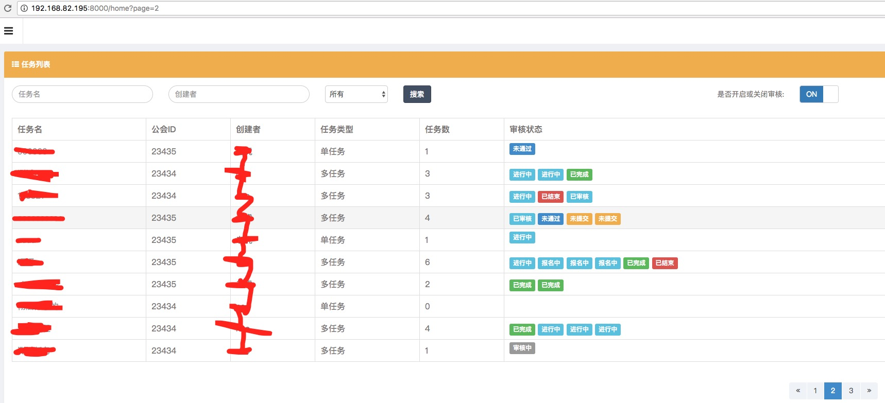
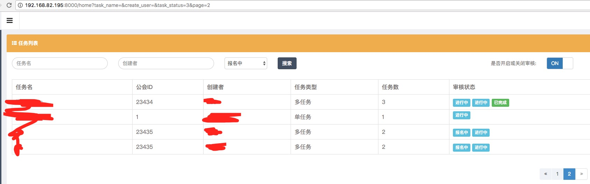

### 目标

由于数据是从mysql和mongodb里的两个表中取数据，并且根据两个表中的字段关联来获取数据，所有没有直接的sql获取。只有通过循环获取。然而获取的数据是数组，无法使用`laravel`自带的`paginate`分页方法。下面是解决办法：

<!-- more -->

### 获取数据 

```php
/**
     * @param $name
     * @param $user
     * @return array
     * 获取所有被拒绝的子任务
     */
    private function getRejectSubTasks($name,$user)
    {
        $data = [];
        //未提交的子任务
        $subTask = SubTask::where('status',-1)->get();
        //获取所有拒绝的子任务并且去除重复
        $reject = RejectReason::select('subTaskId')->distinct()->get();

        if(!$name && !$user){
            foreach($subTask as $item){
                foreach($reject as $value){
                    if($item->_id == $value->subTaskId){
                        $data[] = Task::where('taskId',$item->taskId)->first();
                    }
                }
            }
        }
        if($name){
            foreach($subTask as $item){
                foreach($reject as $value){
                    if($item->_id == $value->subTaskId){
                        $data[] = Task::where('taskId',$item->taskId)->where('name','like',"%$name%")->first();
                    }
                }
            }
        }
        if($user){
            foreach($subTask as $item){
                foreach($reject as $value){
                    if($item->_id == $value->subTaskId){
                        $data[] = Task::where('taskId',$item->taskId)->where('user','like',"%$user%")->first();
                    }
                }
            }
        }
        if($name && $user){
            foreach($subTask as $item){
                foreach($reject as $value){
                    if($item->_id == $value->subTaskId){
                        $data[] = Task::where('taskId',$item->taskId)
                            ->where('name','like',"%$name%")
                            ->where('user','like',"%$user%")
                            ->first();
                    }
                }
            }
        }
        return  $data;
    }
```

### 数组分页

```php
/**
 * @param $searchResults 数组
 * @return LengthAwarePaginator
 * 给数组分页
 */
public function arrayPage($searchResults)
{
    //获取当前的分页数，就是第6这样的
    $currentPage = LengthAwarePaginator::resolveCurrentPage();

    //实例化collect方法
    $collection = new Collection($searchResults);

    //定义一下每页显示多少个数据
//        $perPage = 5;

    //获取当前需要显示的数据列表$currentPage * $this->prePage
    $currentPageSearchResults = $collection->slice(($currentPage - 1) * $this->prePage, $this->prePage)->all();

    //创建一个新的分页方法
    $paginatedSearchResults= new LengthAwarePaginator($currentPageSearchResults, count($collection), $this->prePage);

    //给分页加自定义url
    $paginatedSearchResults = $paginatedSearchResults->setPath(env("APP_HOST") . '/home');

    return $paginatedSearchResults;
//        return view('search', ['results' => $paginatedSearchResults]);
}

```

### 前台页面显示

```html
<div class="form-group">
    <div class="col-md-2 col-md-offset-10">
        @if(empty($_GET['task_name']) && empty($_GET['create_user']) && empty($_GET['task_status']))
            {{ $task->links() }}
        @endif
        @if(isset($_GET['task_name']) && isset($_GET['create_user']) && isset($_GET['task_status']) && $_GET['task_status'] != 0 )
            {{ $task->appends([
                'task_name' => $_GET['task_name'],
                'create_user' => $_GET['create_user'],
                'task_status' => $_GET['task_status']
                ])->links() }}
        @endif
    </div>
</div>
```

### 效果如下


