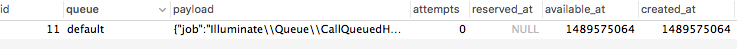
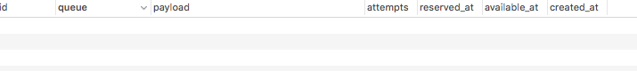
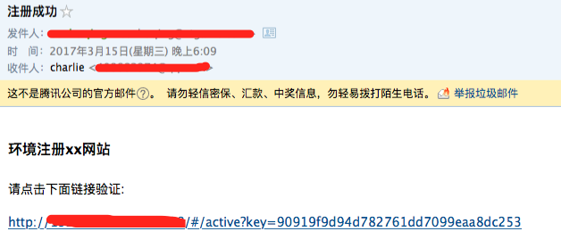

### 简介
Lumen 的队列服务为不同的队列后端系统提供了一套统一的 API 。队列允许你将一个耗时的任务进行延迟处理，例如像 e-mail 发送。这能让应用程序对页面的请求有更快的响应。

Lumen 和 Laravel 的队列功能除了接下来会列出来的不同点以外，并没有太大区别，所以更多关于 Lumen 队列的使用，请参阅 [Laravel](http://laravelacademy.org/post/6922.html) 文档 。

<!-- more -->

### 配置信息
队列的配置在 `.env` 中 `QUEUE_DRIVER` 选项里。

```sh
QUEUE_DRIVER=database
```

如果你想完全自定义配置信息，你可以复制 `vendor/laravel/lumen-framework/config/queue.php` 整个文件到 `config/queue.php` 中，根目录如果没有 `config` 的话你应该创建一个。


```php
<?php

return [

    'default' => env('QUEUE_DRIVER', 'database'),

    'connections' => [

        'sync' => [
            'driver' => 'sync',
        ],

        'database' => [
            'driver' => 'database',
            'table' => 'jobs',
            'queue' => 'default',
            'retry_after' => 60,
        ],

        'beanstalkd' => [
            'driver' => 'beanstalkd',
            'host' => 'localhost',
            'queue' => 'default',
            'retry_after' => 60,
        ],

        'sqs' => [
            'driver' => 'sqs',
            'key' => 'your-public-key',
            'secret' => 'your-secret-key',
            'queue' => 'your-queue-url',
            'region' => 'us-east-1',
        ],

        'redis' => [
            'driver' => 'redis',
            'connection' => 'default',
            'queue' => 'default',
            'retry_after' => 60,
        ],

    ],

    'failed' => [
        'database' => env('DB_CONNECTION', 'mysql'),
        'table' => env('QUEUE_FAILED_TABLE', 'failed_jobs'),
    ],
];
?>
```


### 创建表
要使用 `database` 这个队列驱动的话，则需要创建一个数据表来记住任务:

```php
Schema::create('jobs', function (Blueprint $table) {
    $table->bigIncrements('id');
    $table->string('queue');
    $table->longText('payload');
    $table->tinyInteger('attempts')->unsigned();
    $table->tinyInteger('reserved')->unsigned();
    $table->unsignedInteger('reserved_at')->nullable();
    $table->unsignedInteger('available_at');
    $table->unsignedInteger('created_at');
    $table->index(['queue', 'reserved', 'reserved_at']);
});
```

### 生成任务类
Lumen 中没有可用来生成事件监听器的命令，你可以复制 `ExampleJob` 文件，这个示例文件提供了基础的类结构，你可以作为参考。基类 `Job` 已经加载了我们需要的 traits `InteractsWithQueue`, `Queueable`, 和 `SerializesModels`

```php

<?php
namespace App\Jobs;
use Illuminate\Support\Facades\Mail;

class SendReminderEmail extends Job
{
    protected $email;

    protected $active;

    protected $subject;

    /**
     * 创建一个新的任务实例
     *
     * @param $email
     */
    public function __construct($email, $active, $subject)
    {
        $this->email = $email;
        $this->active = $active;
        $this->subject = $subject;
    }

    /**
     * 执行任务
     *
     * @return void
     */
    public function handle()
    {
        Mail::send('emails.welcome', ['active' => $this->active, 'subject' => $this->subject], function ($message){
            $message->to($this->email)->subject($this->subject);
        });
    }
}
```

### 将任务推送到队列上
就如 Laravel 一样，你可使用 `dispatch` 辅助函数来推送任务到队列上:

```php
dispatch(new ExampleJob);
```

当然，你也可以使用 `Queue` facade。 如果你想使用 facade 的话，你需要在 `bootstrap/app.php` 中把 `$app->withFacades()` 这行调用的注释去除掉。

```php
Queue::push(new SendReminderEmail($user['email'], $this->active($user['email'],$user['id']),'注册成功'));
```

#### 延迟分发
有时候你可能想要延迟队列任务的执行，可以通过在任务实例使用 `delay` 方法。该方法由`Illuminate\Bus\Queueable` trait提供，已经自动添加在通过命令行生成的任务类中。例如你希望将某个任务在创建 10 分钟以后才执行：

```php
Queue::push(new SendReminderEmail($user['email'], $this->active($user['email'],$user['id'])->delay(Carbon::now())->addMinute(10),'注册成功'));
```

#### 自定义队列和连接
通过推送任务到不同队列，你可以将队列任务进行“分类”，甚至根据优先级来分配每个队列的进程数。请注意，这并不意味着使用了配置项中那些不同的连接来管理队列，实际上只有单一连接会被用到。要指定队列，请在任务实例使用 `onQueue` 方法。要指定连接设备可以用 `onConnection` 方法。

```php
Queue::push(new SendReminderEmail($user['email'], $this->active($user['email'],$user['id'])->onConnection('redis')->onQueue('emails'),'注册成功'));
```

#### 指定最大失败次数/超时时间
指定队列任务最大失败次数的一种实现方式是通过 Artisan 命令 `--tries` 切换：

```php
php artisan queue:work --tries=3
```

类似的，队列任务最大运行时长（秒）可以通过 Artisan 命令 `--timeout` 来指定

```php
php artisan queue:work --timeout=30
```


### 运行队列任务
Laravel 包含了一个队列进程用来处理被推送到队列的新任务。你可以使用 `queue:work` 命令运行队列进程。请注意，队列进程开始运行后，会持续监听队列，直至你手动停止或关闭终端：

```php
php artisan queue:work
```

>注：为了保持队列进程 `queue:work` 持续在后台运行，需要使用进程守护程序，比如 `Supervisor` 来确保队列进程持续运行。

请记住，队列进程是长生命周期的进程，会在启动后驻留内存。若应用有任何改动将不会影响到已经启动的进程。所以请在发布程序后，重启队列进程。

### 配置Supervisor
Supervisor 是 Linux 系统中常用的进程守护程序。如果队列进程 `queue:work` 意外关闭，它会自动重启启动队列进程。在 Mac 安装Supervisor 非常简单：

```sh
$ brew search |grep supervisor                                                                                                                       
supervisor
$ brew install supervisor
```

#### 添加配置文件
Supervisor 配置文件通常存放在 `/usr/local/etc/supervisord.conf` 目录，在该目录中，可以创建多个配置文件指示 `Supervisor` 如何监视进程，例如，让我们创建一个开启并监视`queue:work` 进程的 `laravel-worker.conf` 文件：

```php
[program:laravel-worker]
process_name=%(program_name)s_%(process_num)02d
command=php /Users/zt-2203315/www/gametest/artisan queue:work  --sleep=3 --tries=3
autostart=true
autorestart=true
numprocs=8
redirect_stderr=true
stdout_logfile=/tmp/worker.log
```

在本例中，`numprocs` 指令让 Supervisor 运行 8 个 `queue:work` 进程并监视它们，如果失败的话自动重启。当然，你需要修改 `queue:work` `database` 的 `command` 指令来映射你的队列连接。

#### 启动Supervisor
当你成功创建配置文件后，你需要刷新 Supervisor 的配置信息并使用如下命令启动进程:

```sh
$ supervisord
$ ps aux |grep supervisord |grep -v grep
zt-2203315       94458   0.0  0.0  2470732   6320   ??  Ss    6:12PM   0:01.65 /usr/local/Cellar/supervisor/3.3.1/libexec/bin/python /usr/local/bin/supervisord
$ supervisorctl
laravel-worker:laravel-worker_00   RUNNING   pid 94546, uptime 0:35:28
laravel-worker:laravel-worker_01   RUNNING   pid 94547, uptime 0:35:28
laravel-worker:laravel-worker_02   RUNNING   pid 94548, uptime 0:35:28
laravel-worker:laravel-worker_03   RUNNING   pid 94549, uptime 0:35:28
laravel-worker:laravel-worker_04   RUNNING   pid 94550, uptime 0:35:28
laravel-worker:laravel-worker_05   RUNNING   pid 94551, uptime 0:35:28
laravel-worker:laravel-worker_06   RUNNING   pid 94552, uptime 0:35:28
laravel-worker:laravel-worker_07   RUNNING   pid 94553, uptime 0:35:28
```

### 测试

>请注意：要先停止supervisor的laravel-work服务

```sh
supervisor> shutdown
Really shut the remote supervisord process down y/N? y
Shut down
```

发送邮件给用户

```javascript
{
  "code": 0,
  "data": "",
  "msg": "邮件已重新发送"
}
```

测试结果


启动supervisor

```sh
$ supervisord
$ tail -f /tmp/worker.log
[2017-03-15 18:56:46] Processed: App\Jobs\SendReminderEmail
```

再次查看数据表,已经为空


查看邮箱


### 参考

<https://lumen.laravel-china.org/docs/5.3/queues>

<http://laravelacademy.org/post/6922.html>
