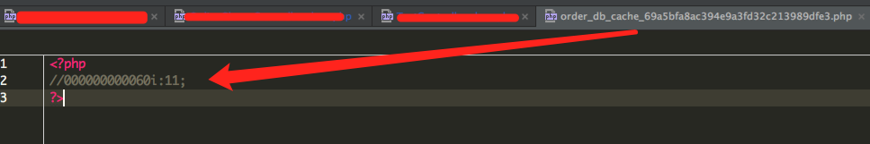
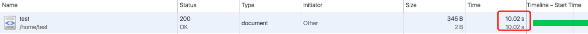
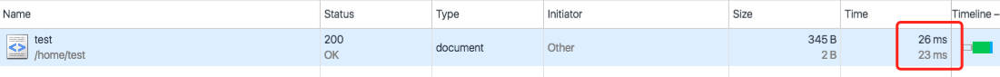

由于第一次打开页面会很慢，所以需要做个数据缓存。正好thinkphp框架有封装好的方法，这里说下如何操作的；

1.首先介绍数据缓存的用法
<pre class="lang:php decode:true ">// 缓存初始化
S(array('type'=&gt;'xcache','expire'=&gt;60));</pre>
缓存初始化可以支持的参数根据不同的缓存方式有所区别，常用的参数是：
<!-- more -->

|参数|描述|
|----|----|
|expire|缓存有效期(时间为秒)|
|prefix|缓存标识前缀|
|type|缓存类型|

系统目前已经支持的缓存类型包括：`Apachenote、Apc、Db、Eaccelerator、File、Memcache、Redis、Shmop、Sqlite、Wincache和Xcache`。

如果S方法不传入type参数初始化的话，则读取配置文件中设置的`DATA_CACHE_TYPE`参数值作为默认类型。同样的道理，prefix参数如果没有传入会读取配置文件的`DATA_CACHE_PREFIX`参数值，expire参数没有传入则读取`DATA_CACHE_TIME`配置值作为默认。

2.缓存设置
<pre class="lang:php decode:true ">// 设置缓存
S('name',$value);
// 缓存数据300秒
S('name',$value,300);
// 采用文件方式缓存数据300秒
S('name',$value,array('type'=&gt;'file','expire'=&gt;300));</pre>
3.缓存读取
<pre class="lang:php decode:true ">// 读取缓存
$value = S('name');</pre>
4.缓存删除
<pre class="lang:sh decode:true ">// 删除缓存
S('name',null);</pre>
5.对象方式缓存
<pre class="lang:php decode:true ">// 初始化缓存
$cache = S(array('type'=&gt;'xcache','prefix'=&gt;'think','expire'=&gt;600));
$cache-&gt;name = 'value'; // 设置缓存
$value = $cache-&gt;name; // 获取缓存
unset($cache-&gt;name); // 删除缓存</pre>
6.缓存队列
<pre class="lang:php decode:true ">//设置了length参数后，系统只会缓存最近的100条缓存数据。
S(array('type'=&gt;'xcache','length'=&gt;100,'expire'=&gt;60));</pre>
7.具体操作，我的代码如下
<pre class="lang:php decode:true ">  public function test()
    {
        $cacheConfig = array(
            'type' =&gt; 'file',
            'expire' =&gt; 60,
            'prefix' =&gt; 'order_db_cache_'
        );
        if(!$num = S('test','',$cacheConfig)){
            sleep(10);
            $num = 11;
            S('test',$num, $cacheConfig);
        }
        echo $num;

    }</pre>
8.访问该方法,生成缓存文件

第一次访问时间

第二次访问时间

说明已经使用上缓存了。
